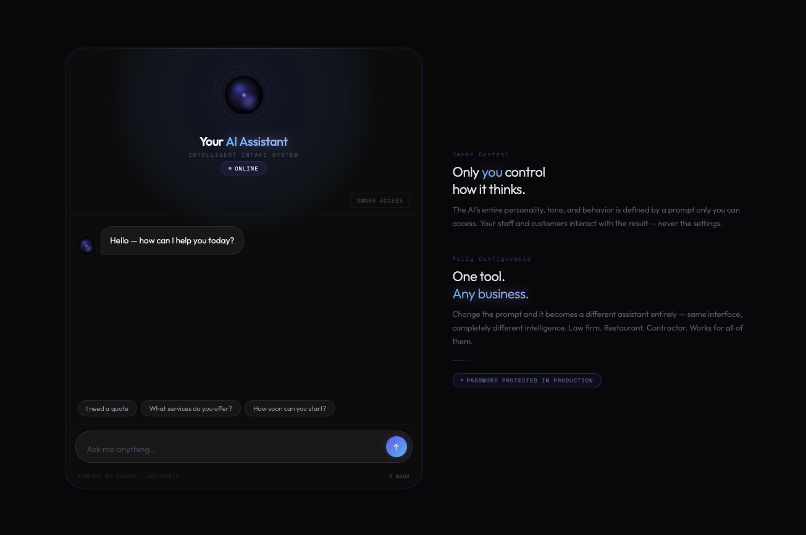

# AI Lead Qualifier Chatbot

### Claude-powered AI intake assistant that qualifies leads, captures contact info, and adapts to any business — with a fully password-protected owner control panel.

---

## What It Does

Drop this on any business website and it becomes a **24/7 AI sales assistant**. It holds natural conversations with visitors, qualifies them across four dimensions — what they need, location, timeline, and budget — then automatically logs their name and email the moment its collected.

The business owner gets a **password-protected control panel** to configure everything. Staff and customers never see the settings.

---

## Features

### Core
- **Real AI conversations** — powered by Claude Sonnet via secure backend proxy. API key never touches the browser.
- **Automatic lead capture** — parses and logs name + email with timestamp. No manual entry.
- **Dynamic suggested replies** — Claude generates context-aware follow-up chips after every response
- **Typing simulation** — greeting animates on load for a live, human feel
- **Rate limiting** — 20 messages per IP per hour via Flask backend

### Owner Control Panel
- **Password protected** — full panel hidden behind owner verification. Staff and customers see only the chat.
- **10 premium themes** — Indigo, Obsidian, Ember, Vetiver, Dusk, Soleil, Onyx Rose, Glace, Terre, Void
- **13 custom color pickers** — granular control: orb inner, orb core glow, orb sweep, rings, bloom glow, card background, page background, user bubble, AI bubble, gradient text A/B, status chip
- **Configurable system prompt** — change the AIs entire personality instantly. Same interface, completely different intelligence.
- **Mobile preview mode** — toggle 390px layout inside the panel
- **Leads captured log** — timestamped name + email entries visible to owner only
- **Embed code** — one-line script tag for deployment on any website

### Design
- **Living orb animation** — canvas-based rotating inner light + core pulse, fully theme-aware
- **Breathing UI** — bloom, shine, and rings pulse together
- **Flowing gradient text** — AI Assistant gradient animates continuously

---

## Tech Stack

| Layer | Technology |
|---|---|
| AI Model | Claude Sonnet (Anthropic API) |
| Frontend | Vanilla HTML / CSS / JS — zero dependencies |
| Backend | Python Flask + flask-cors |
| Animation | HTML5 Canvas API |
| Hosting | GitHub Pages |
| Dev Tunnel | ngrok |

---

## Architecture

    Visitor (Browser)
        |
        v
    GitHub Pages  ------  Serves the UI (index.html)
        |
        |  POST /chat  (no API key in browser)
        v
    Flask Server  ------  Rate limiting / Key management
        |
        |  Anthropic API call
        v
    Claude Sonnet  -----  AI response + lead tag parsing
        |
        v
    Flask > Browser > UI renders response

The Anthropic API key lives exclusively on the server. It is never exposed to the client.

---

## Use Cases

| Industry | How Its Used |
|---|---|
| Home Services | Qualifies roofing, HVAC, plumbing leads 24/7 |
| Legal | Intake for law firm consultations |
| Real Estate | Buyer / seller qualification |
| Restaurants | Reservations and catering inquiries |
| Contractors | Project scoping and estimate requests |
| Any Small Business | Swap the system prompt — instant transformation |

---

## Quick Deploy

1. Clone the repo
2. pip install flask flask-cors
3. Add your Anthropic API key to chatbot_server.py
4. python chatbot_server.py
5. ngrok http 5050
6. Update SERVER in index.html with your ngrok URL
7. Set OWNER_PW in index.html to your password

---

## Built By

**Jovan Q.** — Python & AI Automation Developer

I build Claude API integrations, business automation tools, and AI-powered products that work in the real world. Available for freelance projects on Upwork.

Need a chatbot like this for your business or want one built for your clients? Lets talk.
